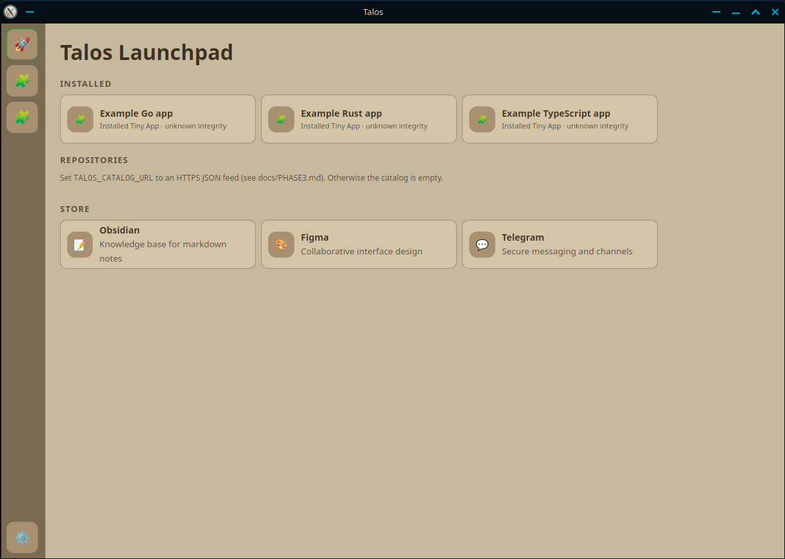

# Talos

Talos is a secure desktop workspace for running internal "Tiny Apps" in one place.  
It helps teams centralize tools, reduce context-switching, and keep sensitive workflows local-first.

---

## Why Talos

Talos is designed for users and organizations that need:

- A consistent employee app experience from onboarding to daily operations.
- Better security boundaries between internal tools.
- Fast internal tool distribution without relying on public app stores.
- Local-first reliability for teams with intermittent or restricted internet access.

In practical terms, Talos gives people one desktop hub where approved mini apps can be launched safely, while IT and engineering keep control over permissions, trust, and update channels.

---

## Product Snapshot

- **Host shell:** Wails + Go desktop runtime
- **App surface:** iframe-based Tiny Apps + optional sidecar binaries
- **IPC:** gRPC over local sockets/pipes (no public TCP exposure by default)
- **Security model:** permission requests, trust states, scoped filesystem access
- **Distribution model:** package install/update + optional signature trust
- **UI platform:** asset-driven themes + Talos Web Components (`@talos/web-components`)

---

## With fully customizable Launchpad and fully customizable themes for the apps inside!




---

## Install Talos (End Users)

### Option 1: Download from GitHub Actions artifacts

1. Go to the **Actions** tab in this repository.
2. Open the latest run of the **Build Talos Installer** workflow.
3. Download the artifact for your OS:
   - `talos-installer-linux-*`
   - `talos-installer-windows-*`
   - `talos-installer-macos-*`
4. Unpack/install according to your platform conventions.

### Option 2: Build locally

```bash
make app-build
```

This produces production artifacts under `build/bin`.

---

## Run in Development Mode

```bash
make dev
```

What this does:

- Regenerates protobufs
- Builds Launchpad frontend
- Starts Talos with `TALOS_DEV_MODE=1`

---

## Build and Develop Tiny Apps

If you want to build internal apps for Talos:

1. Read the package guide: `docs/build-your-app/README.md`
2. Start with manifest and layout rules: `docs/build-your-app/02-package-layout-and-manifest.md`
3. Follow Tiny App bootstrap: `docs/TINY_APP_INIT.md`
4. Use SDK docs: `docs/SDK_GUIDE.md`
5. Use component/theming docs: `docs/ASSET_DRIVEN_THEMES.md` and `docs/build-your-app/07-talos-ui-and-themes.md`

Quick command set:

```bash
make help
make proto
make verify
make example-go-app-build
make example-rust-app-build
make example-ts-app-build
```

Default example apps are package-local under:

- `Packages/Example Go App`
- `Packages/Example Rust App`
- `Packages/Example TS App`

The TypeScript example app demonstrates:

- React + `@talos/web-components`
- host-driven theme sync on first launch and live updates
- scoped file read/write through Talos runtime with permission checks

---

## Security and Trust Summary

- Package trust statuses are surfaced in Launchpad (`ok`, `unsigned`, `signed_ok`, `signed_invalid`, `tampered`).
- Permissions are host-mediated and auditable.
- Filesystem writes are scoped by default to package-local data directories.
- Iframe bridge requests are validated by channel, instance source, bridge token, and allowed origins.
- Optional strict trust mode can block tampered packages from running.

See:

- `docs/PHASE3.md`
- `docs/STATUS.md`
- `docs/dev/IFRAME_THREAT_MODEL.md`

---

## Engineering References

- `docs/DEVELOPMENT.md`
- `docs/DEVELOPMENT_FULL.md`
- `docs/dev/README.md`
- `docs/STATUS.md`
- `docs/PHASE4.md`
- `docs/ASSET_DRIVEN_THEMES.md`
